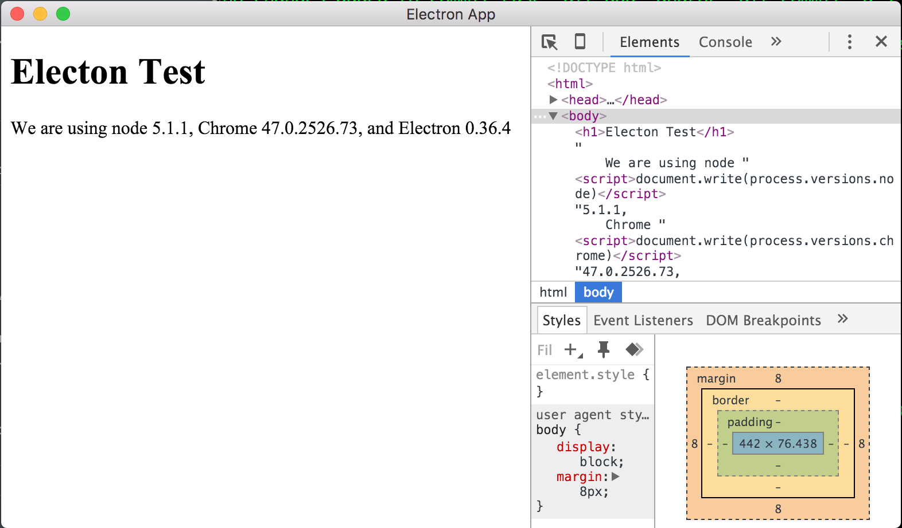

# Electron Test

#### How to run the Electron app
- Since `electron-prebuilt` was installed locally, type this in the console:

```BASH
$ ./node_modules/.bin/electron .
```
An Electron app should start running like so:


